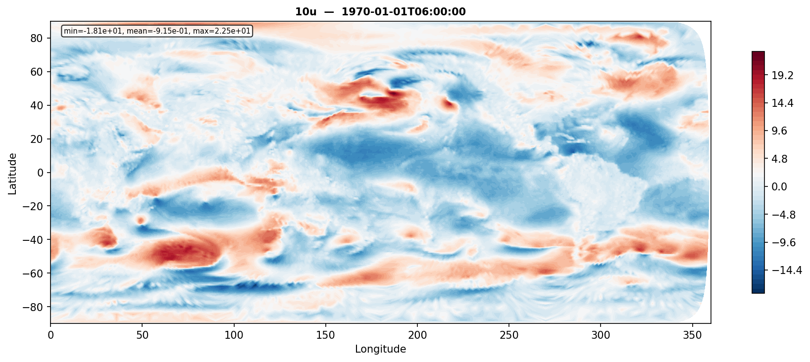
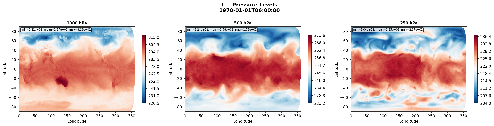
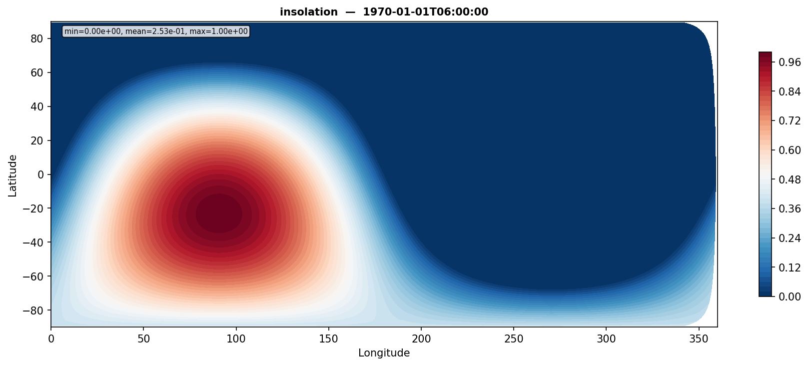

# anemoi-datasets-eeriecloud

Source plugin for [anemoi-datasets](https://github.com/ecmwf/anemoi-datasets) that loads climate data from the [EERIE project](https://eerie-project.eu/) via the DKRZ STAC catalogue.

## Installation

```bash
pip install -e .
```

Or with fallback regridding support:
```bash
pip install -e ".[fallback]"
```

## Quick Start

Use the `eeriecloud` source in an anemoi recipe:

```yaml
dates:
  start: "1970-01-01T06:00:00"
  end: "2014-12-31T18:00:00"
  frequency: 6h

input:
  join:
    - eeriecloud:
        dataset: eerie-ifs-fesom-hist-1950
        item: atmos.gr025.2D_6hourly_instant
        param: [10u, 10v, 2t, 2d, msl, sp, skt, tcw, ci, sst]
        grid: O96
    - constants:
        template: "${input.join.0.eeriecloud}"
        param: [cos_latitude, sin_latitude, cos_longitude, sin_longitude,
                cos_julian_day, sin_julian_day, cos_local_time, sin_local_time,
                insolation]
```

Build the dataset:

```bash
anemoi-datasets create recipes/eerie-ifs-fesom-hist1950-test.yaml test.zarr
```

Plot the output:

```bash
python plot_dataset.py test.zarr --output-dir output_plots
```

## Example Output

**10m u-wind (10u) — O96 grid, 1970-01-01 06:00 UTC:**



**Temperature on pressure levels (1000, 500, 250 hPa):**



**Insolation (forcing field):**



## Parameters

| Parameter | Required | Description |
|-----------|----------|-------------|
| `dataset` | Yes* | Preset name (e.g. `eerie-ifs-fesom-hist-1950`) |
| `collection` | Yes* | Explicit STAC collection ID (alternative to `dataset`) |
| `item` | Yes | STAC item descriptor (e.g. `atmos.gr025.2D_6hourly_instant`) |
| `param` | No | List of variable names to select |
| `levelist` | No | Pressure levels in hPa |
| `grid` | No | Target grid for regridding (e.g. `O96`) |
| `interpolation` | No | Regridding method: `earthkit` (default) or `fallback` |
| `asset` | No | STAC asset key: `eerie-cloud` (default) or `dkrz-disk` |

*One of `dataset` or `collection` must be provided.

## Available Presets

| Preset | Collection |
|--------|------------|
| `eerie-ifs-fesom-hist-1950` | `eerie-eerie-ecmwf-awi-ifs-fesom2-sr-hist-1950-v20240304` |

## Available Items (IFS-FESOM hist-1950)

### Atmosphere
- `atmos.gr025.2D_6hourly_instant` — Surface instantaneous fields (0.25° grid)
- `atmos.gr025.2D_6hourly_accumulated` — Accumulated fields (tp, cp)
- `atmos.gr025.3D_6hourly` — Upper-air fields on pressure levels
- `atmos.native.2D_6hourly_instant` — Surface fields on native TCo1279 grid
- `atmos.native.3D_6hourly` — Upper-air fields on native grid

### Ocean
- `ocean.gr025.2D_daily_avg_1950-2014` — Ocean surface averages (0.25°)

### Land
- `land.native.3D_daily_avg` — Land surface fields

## Example Recipes

See the `recipes/` directory:
- `eerie-ifs-fesom-hist1950-o96.yaml` — Full coupled recipe with O96 regridding
- `eerie-ifs-fesom-hist1950-native.yaml` — Native grid, no regridding
- `eerie-ifs-fesom-hist1950-test.yaml` — Quick test (24 timesteps, 3 levels)

## Variable Reference (matching aifs-ea-an-oper-0001-mars-o96-1979-2023-6h-v8)

**Surface instant (10):** 10u, 10v, 2d, 2t, msl, sp, skt, tcw, ci, sst

**Pressure level (6 × 13 levels = 78):** q, t, u, v, w, z
at levels: 1000, 925, 850, 700, 600, 500, 400, 300, 250, 200, 150, 100, 50

**Accumulated (2):** tp, cp

**Constants/forcings (9):** cos_latitude, sin_latitude, cos_longitude, sin_longitude, cos_julian_day, sin_julian_day, cos_local_time, sin_local_time, insolation

**Total: 99 variables** (add lsm, sdor, slor, z_sfc from MARS for 103)

## Development

```bash
pip install -e ".[dev]"
pytest tests/
```
